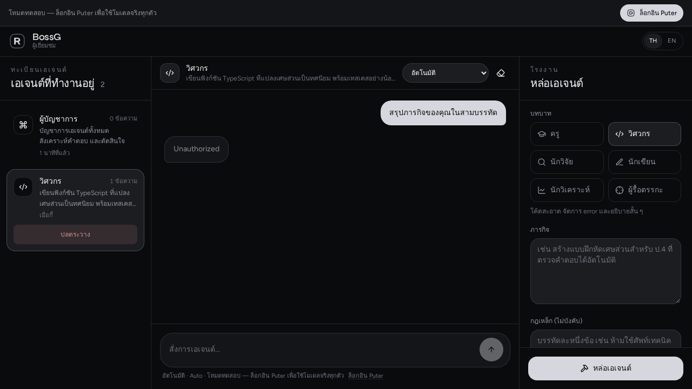
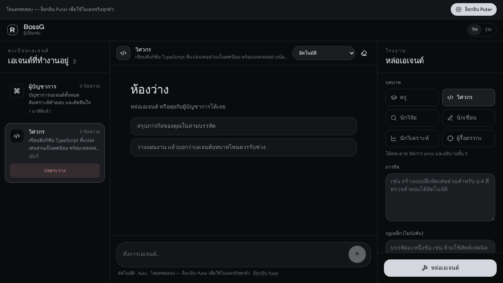
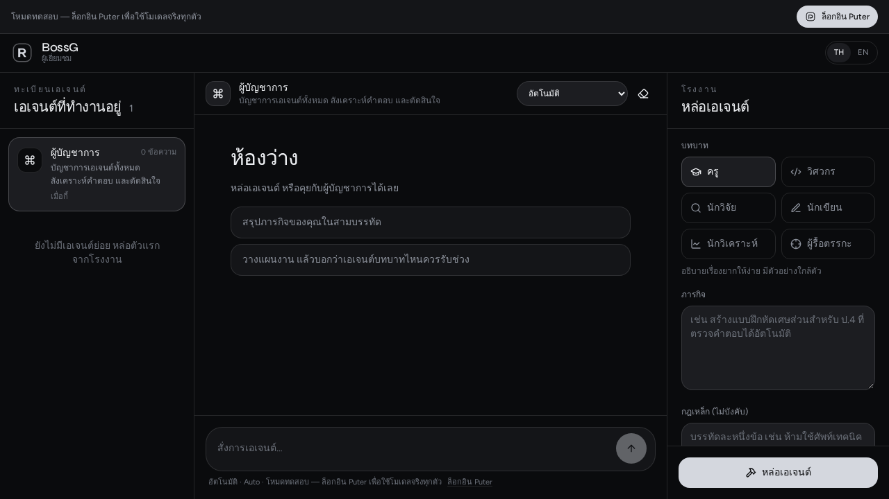

# 🚀 BossnuGrok

**The AI Commander, not another framework.**

> เปิดเว็บ → สั่งงาน → ได้ผลลัพธ์  
> ไม่ต้องเขียนโค้ด ไม่ต้องประกอบ Agent เอง

**Live Demo**: [https://panupan22.vercel.app](https://panupan22.vercel.app)

[](https://panupan22.vercel.app)
[](https://github.com/appleid7899067-netizen/Panupan22)
[](https://github.com/appleid7899067-netizen/Panupan22/stargazers)

---

## เรียกบอทในห้องแชท

บอทอยู่ห้องที่คุย **และเรียกสกิลเอง** ไม่ต้องส่งไปโหมดอื่น

| ห้อง | วิธีเรียก |
|---|---|
| เว็บ | พิมพ์ใน Command Center ตามปกติ |
| GitHub Copilot Chat | เลือก agent **BossnuGrok** (หรือ Teacher / Coder / …) |
| GitHub Issue / PR | คอมเมนต์ `/boss คำถาม` |
| Discord | slash `/boss` |
| Telegram กลุ่ม | `/boss คำถาม` |
| HTTP | `POST /api/chat` |

คู่มือเต็ม: [`docs/CHAT_BOT.md`](docs/CHAT_BOT.md)  
Agents: [`.github/agents/`](.github/agents/) · Skills: [`.github/skills/`](.github/skills/) · Kernel: [`src/lib/bossnugrok/chat-kernel.ts`](src/lib/bossnugrok/chat-kernel.ts)

---

## BotFlow visualizer

Every chat reply shows the bot pipeline live: receive → guards → skill → model → process → render.

| View | What it is |
|---|---|
| Flow | Step chart with running / done / error |
| Timeline | Clocked events as the bot works |
| Progress | Percent while processing |
| Status | LIVE · skill · model · duration |

Toggle views from the branch icon in the chat header: stack or rail layout, compact density, and each panel on/off.

---

## 📸 Preview

<p align="center">
  
</p>

<p align="center">
  
  
</p>

<p align="center">
  
</p>

---

## 🎯 Positioning: Finished Commander vs Framework Toolbox

| Dimension              | **BossnuGrok**                          | CrewAI / LangGraph / LangChain      |
|------------------------|-----------------------------------------|-------------------------------------|
| **Target User**        | End users who want results now          | Developers who want to build        |
| **How to use**         | Open web → give order → get result      | Write code → define agents → run    |
| **Core Value**         | "Commander" experience – one entry, auto-dispatch everything | "Toolbox" – highly customizable    |
| **Learning Curve**     | Almost zero                             | Requires coding + architecture knowledge |
| **Underlying Models**  | Grok 4.5 + Puter (40 models available)  | Model-agnostic                      |

### Car Analogy

- **LangChain / LangGraph** → Engine, chassis, screws. You build the car yourself.
- **CrewAI** → Pre-assembled team collaboration kit. Define roles and it runs.
- **BossnuGrok** → Fully built command vehicle. You sit in the driver’s seat and give orders. It handles all systems for you.

---

## ✨ Why BossnuGrok?

### Advantages

- **Zero setup** — Click the link and start talking. No 2–4 hours of scaffolding like CrewAI.
- **Extremely low backend cost** — Powered by Puter.js User-Pays model. Developers can integrate Grok 4.5 for free; users pay their own token usage.
- **Strong model economics** — Grok 4.5 is ~1/5 the cost of Claude Opus 4.8 while being significantly faster (first token < 0.5s).
- **Production-ready stack** — Full frontend + server + auth + skills system. Not a demo.

### What frameworks still do better

- Extreme customizability (graph topology, state machines, resume)
- Embeddability into your own products
- Mature ecosystem & community (LangGraph 26k+ stars, CrewAI 52k+ stars)
- Enterprise observability & human-in-the-loop at scale

**BossnuGrok and frameworks are complementary, not competitors.**  
You can use LangGraph for core logic inside your product and put BossnuGrok as the user-facing “Commander front-end”.

---

## 🏗️ Core Modules (v0.2.0)

Located in [`src/lib/bossnugrok/`](src/lib/bossnugrok/):

| Module                    | Description                                      |
|---------------------------|--------------------------------------------------|
| **Mistral Workflows**     | Multi-step AI pipelines                          |
| **Agent Factory**         | Spawn & manage agents with 6 default roles       |
| **BotFlow Visualizer**    | Live flow + timeline + progress + status in chat |
| **Sandbox Runtime**       | Execute code in 11+ languages safely             |
| **Vibe Work**             | Team atmosphere & collaboration dynamics         |
| **Skill Booster**         | XP / Level / Learning system for agents          |
| **Performance Optimizer** | Caching, rate limiting, metrics                  |
| **Deployment Config**     | Vercel / Docker / CI ready                       |
| **System Integration**    | One entry point that wires everything together   |

Full documentation: [`INSTALLATION_GUIDE.md`](src/lib/bossnugrok/INSTALLATION_GUIDE.md)  
Judge/demo manifest: [`docs/GROKATHON.md`](docs/GROKATHON.md) · `GET /api/capabilities`

---

## 🚀 Quick Start

```bash
# Clone
git clone https://github.com/appleid7899067-netizen/Panupan22.git
cd Panupan22

# Install
npm install

# Run
npm run dev
```

Or just open the live demo: **[panupan22.vercel.app](https://panupan22.vercel.app)**

---

## 💰 Cost Snapshot (Approximate)

| Solution                  | Approx. cost per multi-step task | Notes                              |
|---------------------------|----------------------------------|------------------------------------|
| BossnuGrok + Grok 4.5     | Token usage only                 | Puter free integration, user pays  |
| LangGraph                 | ~$0.08                           | High multi-step accuracy           |
| CrewAI                    | ~$0.12                           | Easy role definition               |
| AG2 (AutoGen)             | ~$0.45                           | Strong multi-agent                 |

Grok 4.5 pricing: **$2 / M input + $6 / M output** (significantly cheaper than Claude Opus 4.8).

---

## 🏆 When to choose what

| You want…                                      | Choose                    |
|------------------------------------------------|---------------------------|
| A ready-to-use AI Commander, no coding         | **BossnuGrok**            |
| Build your own multi-agent system              | LangGraph / CrewAI        |
| Enterprise observability + persistence         | LangGraph                 |
| Fast prototype with roles                      | CrewAI                    |
| Best cost/performance model                    | **BossnuGrok + Grok 4.5** |

---

## 🛠️ Tech Stack

- React 19 + TanStack Start / Router / Query
- Tailwind CSS v4 + Radix UI
- Zustand, Zod
- Better Auth + Neon / PGlite
- Vite + Nitro
- Puter.js (multi-model access)
- Grok 4.5 + Mistral workflows

---

## 🤝 Contributing & Support

Issues and PRs are welcome.

**If you find BossnuGrok useful, please give it a ⭐ star.**  
It is the single best way to support the project and help more people discover it.

---

## 📄 License

MIT

---

**BossnuGrok** — Sit in the commander seat. Give the order. Let the system handle the rest.

Developed by **ภาณุพันธ์ (Panupan)**

<!-- Vercel production redeploy trigger: 2026-09-19 -->
